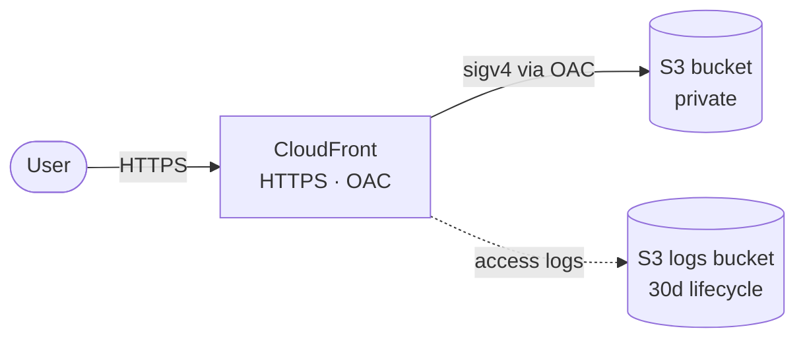

# terraform-aws-static-website

Terraform that provisions an S3 + CloudFront (OAC) stack to host a static site on AWS.

## Architecture



## What you get

- Private S3 origin: public access blocked, `BucketOwnerEnforced`, versioning on, AES256 by default with opt-in SSE-KMS via `kms_key_arn`
- CloudFront distribution with OAC, HTTPS-only viewer policy, `PriceClass_100` (US + EU + IL) by default; `TLSv1.2_2021` floor when a custom ACM cert is wired
- Per-extension cache headers on uploads: HTML revalidates every 5 min, JS/CSS cached for a year (`immutable`), images 1 day
- Sibling logs bucket receiving CloudFront access logs via CloudWatch Log Delivery v2, expiring after `logs_retention_days` (30 by default); bring-your-own bucket via `create_log_bucket`/`log_bucket` and custom `log_prefix`
- Optional custom domain: pass `acm_certificate_arn` (in us-east-1) and `aliases` to attach CNAMEs
- Opt-in security & scale knobs, all off by default: WAFv2 association (`web_acl_id`), IPv6 (`is_ipv6_enabled`), and geo-restriction (`geo_restriction`)
- `default_tags` propagating `Project`, `Environment`, `ManagedBy`, `Owner`, `CostCenter`, `Repository` to every taggable resource

<!-- BEGIN_TF_DOCS -->
## Inputs

| Name | Description | Type | Default | Required |
| ---- | ----------- | ---- | ------- | :------: |
| bucket\_name | Globally-unique S3 bucket name for the site origin. | `string` | n/a | yes |
| project | Project name. | `string` | n/a | yes |
| acm\_certificate\_arn | ARN of an ACM cert in us-east-1 for the distribution. Null uses the default CloudFront cert. | `string` | `null` | no |
| aliases | Alternate domain names (CNAMEs) for the distribution. | `list(string)` | `[]` | no |
| aws\_region | AWS region to deploy resources to | `string` | `"eu-central-1"` | no |
| cloudfront\_price\_class | CloudFront price class. | `string` | `"PriceClass_100"` | no |
| cost\_center | Billing identifier used to attribute spend in AWS Cost Explorer. Tag value, not a real charge code for portfolio use. | `string` | `"personal"` | no |
| create\_log\_bucket | Create a dedicated S3 bucket for access logs. Set false to reuse an existing bucket via log\_bucket. | `bool` | `true` | no |
| create\_route53\_records | Create Route53 alias records pointing at the distribution. Requires route53\_zone\_id. | `bool` | `false` | no |
| default\_root\_object | Object CloudFront serves at the distribution root. | `string` | `"index.html"` | no |
| environment | Environment name. | `string` | `"dev"` | no |
| geo\_restriction | CloudFront geo-restriction. restriction\_type is none\|whitelist\|blacklist; locations are ISO 3166-1-alpha-2 country codes (empty when none). | ```object({ restriction_type = string locations = list(string) })``` | ```{ "locations": [], "restriction_type": "none" }``` | no |
| is\_ipv6\_enabled | Whether the distribution responds to IPv6 (AAAA) requests. | `bool` | `true` | no |
| kms\_key\_arn | KMS key ARN (same region as the origin bucket) for SSE-KMS. Null uses AES256. | `string` | `null` | no |
| log\_bucket | Name of an existing bucket to write logs to. Required when create\_log\_bucket is false. | `string` | `null` | no |
| log\_prefix | S3 key prefix under the log bucket where CloudFront access logs are written. | `string` | `"cloudfront"` | no |
| logs\_retention\_days | Days to retain CloudFront access logs before lifecycle expiration. | `number` | `30` | no |
| owner | Owner of the project. | `string` | `"demoadmin"` | no |
| route53\_zone\_id | Route53 hosted zone ID for alias records. Required when create\_route53\_records is true. | `string` | `null` | no |
| site\_source\_dir | Local directory uploaded to the origin bucket. | `string` | `"www"` | no |
| web\_acl\_id | ARN of a WAFv2 Web ACL (scope = CLOUDFRONT, created in us-east-1) to associate. Null disables WAF. | `string` | `null` | no |

## Outputs

| Name | Description |
| ---- | ----------- |
| bucket\_arn | ARN of the bucket |
| bucket\_name | Name of the bucket for site |
| cloudfront\_url | Public HTTPS URL of the distribution. Use this in browsers and smoke tests. |
| distribution\_domain\_name | Domain name of the CloudFront distribution |
| distribution\_id | ID of the CloudFront distribution |
| oac\_id | ID of the origin access control |
<!-- END_TF_DOCS -->

## Cost notes

Costs come from CloudFront egress/requests and S3 storage. Idle portfolio traffic typically sits inside AWS free-tier limits; once that expires, the bill is dominated by per-GB egress at the `PriceClass_100` rate. Access logs are bounded by the 30-day lifecycle. No Route 53, ACM, or WAF charges in this baseline.

## Design notes

- **OAC over OAI** — CloudFront reads the private origin with SigV4 via Origin Access Control. Rationale in [`docs/decisions/0001-oac-over-oai.md`](docs/decisions/0001-oac-over-oai.md).
- **Public access blocked on every bucket** — both origin and logs apply the four-flag `aws_s3_bucket_public_access_block`.
- **HTTPS-only viewer policy** — `redirect-to-https` on the default CloudFront cert.

## Prerequisites

- Terraform `>= 1.14.0` (uses the Terraform Actions feature for automatic CloudFront invalidation; the S3 backend uses native `use_lockfile` state locking)
- AWS credentials with permission to create S3 buckets and CloudFront distributions
- A globally-unique S3 bucket name
- A directory of site files pointed at by `site_source_dir` — `examples/minimal/www/` is the bundled demo

## Quickstart

```bash
cp terraform.tfvars.example terraform.tfvars
cp backends/dev.s3.tfbackend.example backends/dev.s3.tfbackend
# edit terraform.tfvars: set bucket_name, project, and site_source_dir
terraform init -backend-config=backends/dev.s3.tfbackend
terraform plan
terraform apply
```

The `cloudfront_url` output is the public URL. First-deploy propagation takes a few minutes.

> If `site_source_dir` points at a path that doesn't exist, `fileset()` returns empty and no objects are uploaded — apply succeeds but CloudFront serves 403 on every request. Verify the directory exists before applying.

## Remote state

State is kept in an S3 backend, declared as a partial config (`backend "s3" {}` in `terraform.tf`) so the target is chosen at init time per environment:

```bash
cp backends/<env>.s3.tfbackend.example backends/<env>.s3.tfbackend
# edit the copy: set bucket, key, and region
terraform init -backend-config=backends/<env>.s3.tfbackend
```

Each `backends/<env>.s3.tfbackend` is gitignored; commit only the `.example` templates.

## Updating the site

Edit any file under your `site_source_dir` (the runnable examples ship one under `examples/minimal/www/`), then re-run `terraform apply`. CloudFront is invalidated automatically on every file change, so updates show up within ~30 seconds instead of waiting for the cache TTL.

## Development

```bash
pre-commit install && pre-commit run --all-files   # fmt, validate, tflint, terraform-docs
tflint --init && tflint --recursive                # AWS-specific lint across modules
terraform test                                     # tftest coverage in tests/
```

## Cleanup

```bash
terraform destroy
```

If the bucket isn't empty: `aws s3 rm s3://<BUCKET_NAME> --recursive`, then destroy.
