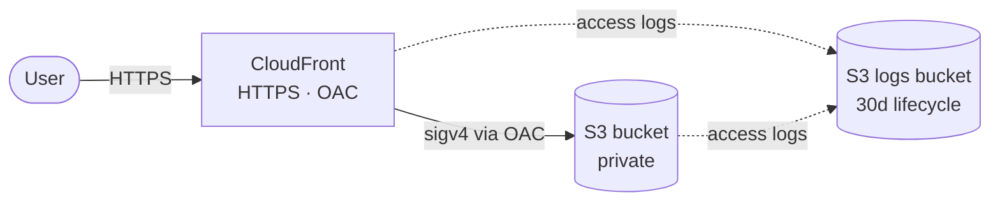

# aws-static-infra

Terraform that provisions an S3 + CloudFront (OAC) stack to host a static site on AWS.

## Architecture



## What you get

- Private S3 origin (public access blocked, AES256 SSE, versioning on)
- CloudFront distribution with OAC, HTTPS-only viewer policy, `PriceClass_100` (US + EU + IL) by default
- Sibling logs bucket capturing both S3 and CloudFront access logs, expiring after 30 days
- `default_tags` propagating `Project`, `Environment`, `Owner`, `CostCenter`, `Repository` to every taggable resource

## Prerequisites

- Terraform `>= 1.6`
- AWS credentials with permission to create S3 buckets and CloudFront distributions
- A globally-unique S3 bucket name

## Quickstart

```bash
cp terraform.tfvars.example terraform.tfvars
# edit terraform.tfvars: set bucket_name and project
terraform init
terraform plan
terraform apply
```

The `cloudfront_url` output is the public URL. First-deploy propagation takes a few minutes.

## Updating the site

Edit anything under `site/`, then re-run `terraform apply`.

> Note: CloudFront caches the previous object for up to 24 h. Manual invalidation is needed until automated invalidation lands (see `REVISION.md` § 2).

## Cleanup

```bash
terraform destroy
```

If the bucket isn't empty: `aws s3 rm s3://<BUCKET_NAME> --recursive`, then destroy.
