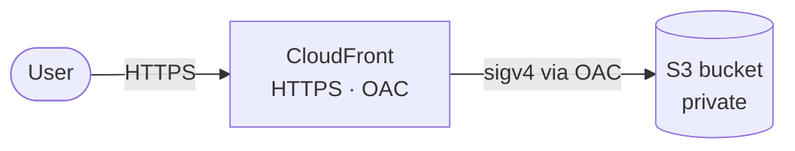

# aws-static-infra

Terraform that provisions an S3 + CloudFront (OAC) stack to host a static site on AWS.

## Architecture



## Prerequisites

- Terraform `>= 1.6`
- AWS credentials with permission to create S3 buckets and CloudFront distributions
- A globally-unique S3 bucket name

## Quickstart

```bash
terraform init
terraform plan  -var="bucket_name=<BUCKET_NAME>"
terraform apply -var="bucket_name=<BUCKET_NAME>"
```

The `cloudfront_url` output is the public URL. First-deploy propagation takes a few minutes.

## Updating the site

Edit anything under `site/`, then re-run `terraform apply`.

## Cleanup

```bash
terraform destroy -var="bucket_name=<BUCKET_NAME>"
```

If the bucket isn't empty: `aws s3 rm s3://<BUCKET_NAME> --recursive`, then destroy.
